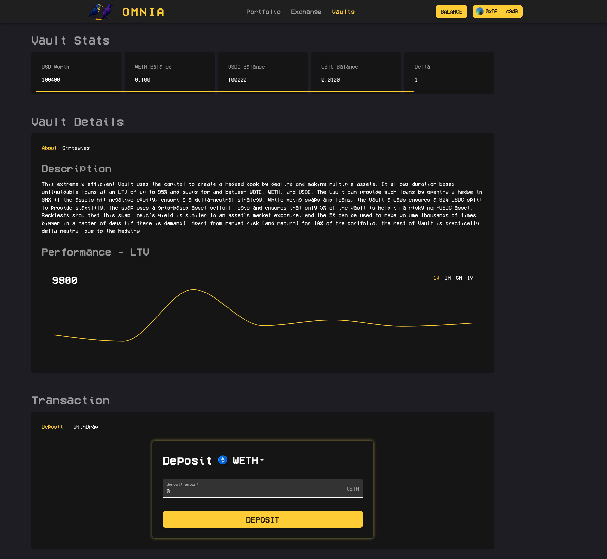
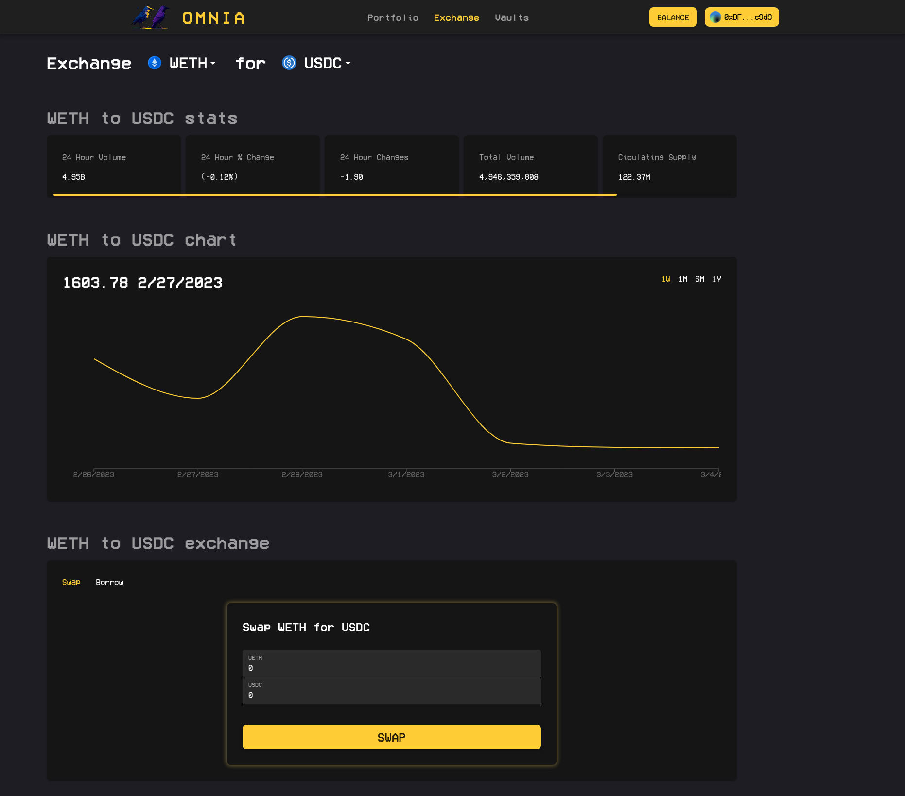
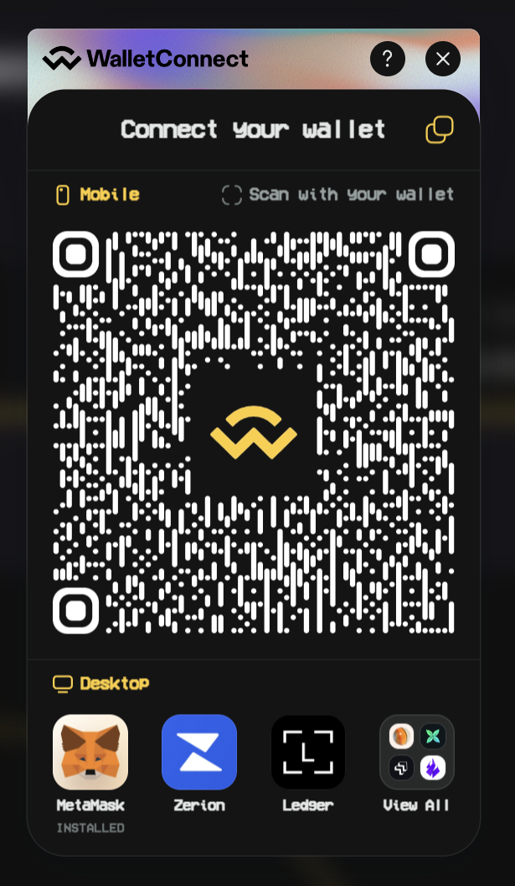
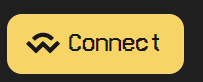
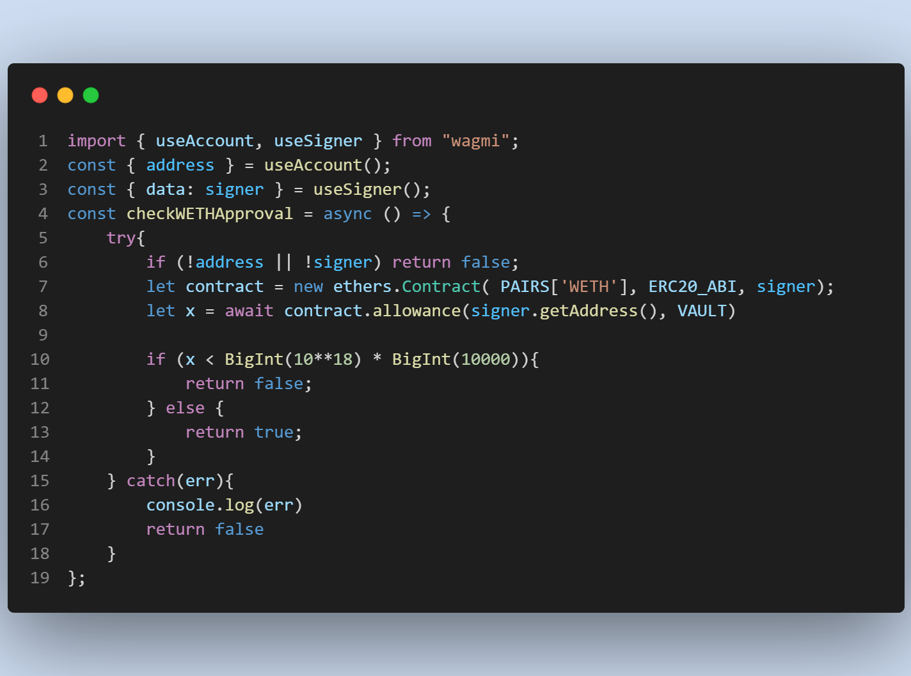
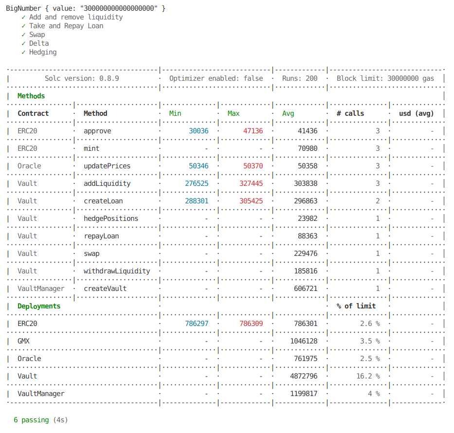

# Omnia Protocol

- <a href="https://omnia-ui-qd8h.vercel.app/">Deployment</a>
- <a href="https://github.com/warproxxx/omnia-backtest">Backtest</a>
- <a href="https://github.com/warproxxx/omnia-ui">UI</a>

  
&nbsp; &nbsp; &nbsp; &nbsp;
  

Omnia is a Highly Efficient DeFi protocol that integrates hedging and complex market-making logic to provide multiple services to ERC20 assets from a single vault.

The currently deployed Vault uses a hold-out grid trading logic to use a small percentage of its capital to make volume thousands of times bigger without any Impermanent Loss by exposing less than 5% of the Vault to market risk.

Furthermore, it provides duration-based ERC20 loans at an LTV, unheard of in DeFi, with no additional risk  to the LPs (apart from funding rate risks which can be integrated into APR) or the risk of liquidation to borrowers. It does so by hedging the LP position in the perpetual swap market if no other vault action has hedged it and the position nears negative equity.

We believe that the current DeFi Vaults are too disconnected and don't allow or do complex action that is core to the success of many centralized entities. We believe this is the biggest reason why providing 0.3% to LPs still results in unprofitability and selling tail risk and protocol as yield is popular.

Thus we create a skeleton to a direction in which complex strategies and hedging logic can be created in Vaults and executed seamlessly for the user. We envision Omnia as an ecosystem where different Vaults use different strategies, metrics, and hedging logic, like selling options and perps, to deal with different assets and create a one-stop shop for different action for the user.

#ETH Denver 2023 BUIDLathon

### 🚝Track: 
#### Decentralized Finance

### 💰 Bounties:
##### - Web3Modal Theming Challenge
OMNIA utilizes and customize the Web3Modal theming to match the OMNIA brand. That includes both **color** and **font**. Here is a screenshot of the Web3Modal theme in action:

###### Web3modal

###### Web3modal button

##### - Web3Modal Creative Challenge
All smart contract transactions in OMNIA are initialized via the Web3Modal SDK. This allows users to connect to their wallet of choice and sign transactions. In OMNIA, all wallet states are handled by Web3Modal.

All contracts transactions are located in the src/hooks/useContractHelpers.ts file. Which utlizie the wagmi SDK to get the signer and initialize the contract.

For example this is one of the function that checks for WETH approval 

##### - Web3Modal DeFi Challenge: Making Bank (Without the Banks)
OMNIA UI provides a simple and easy user interface for users to interact with the OMNIA smart contracts. Web3Modal plays a crucial role in all of the transactions that occur in the OMNIA.

# Repository
The contracts are located in contracts folder and tests in tests folder. This repository is a part of stack which includes <a href="https://github.com/warproxxx/omnia-backtest">omnia-backtests</a> and <a href="https://github.com/warproxxx/omnia-ui">omnia-ui</a> made with a couple sleepless nights in ETHDenver 2023.

Copy the .env-example and make .env to start the repo. Run tests with:
>npm run test

To deploy on goerli:
>npm run deploy:goerli